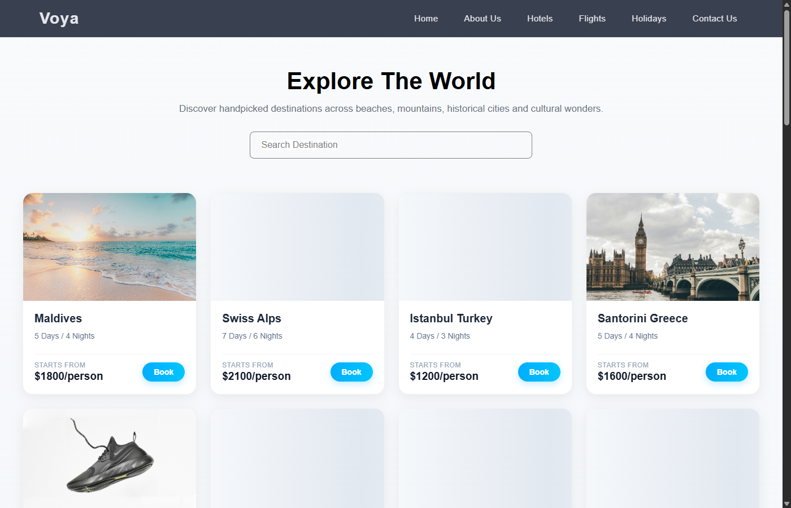
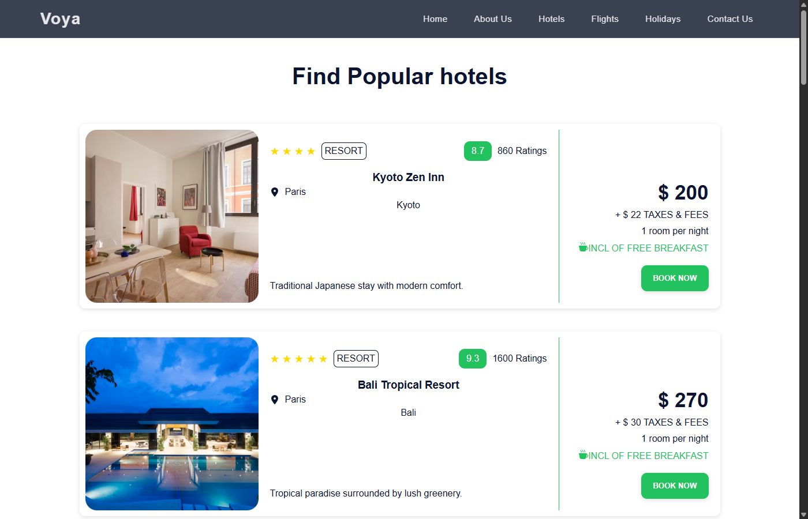
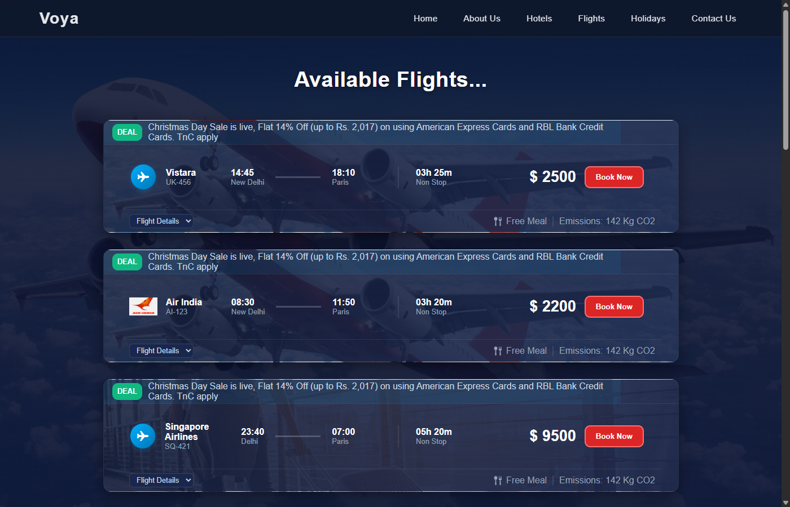
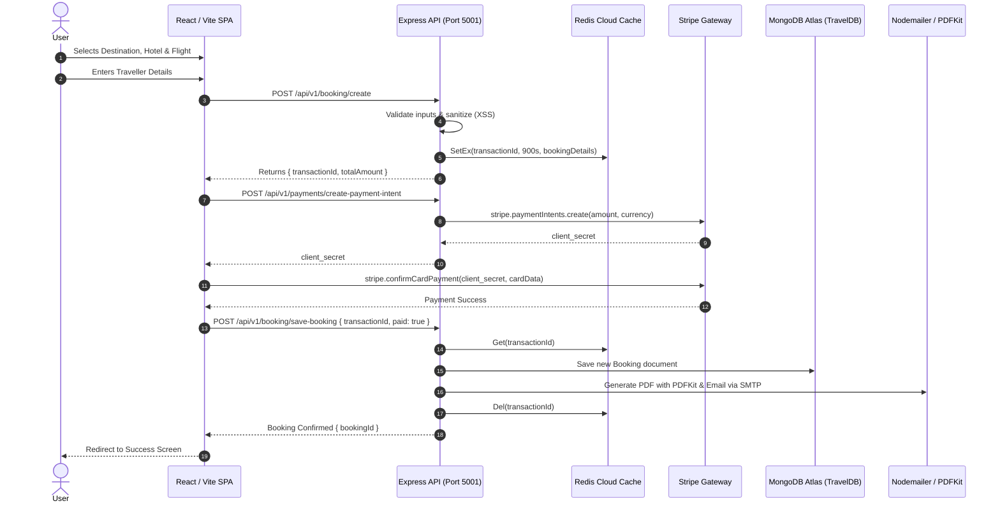

# 🌍 Voya — Full-Stack Travel & Hospitality Booking Platform

[](https://react.dev/)
[](https://vitejs.dev/)
[](https://nodejs.org/)
[](https://www.mongodb.com/)
[](https://redis.io/)
[](https://stripe.com/)

Voya is a production-style, full-stack travel booking application built with the MERN stack (MongoDB, Express, React, Node.js) and powered by Redis Cloud and Stripe. The platform provides an end-to-end booking flow: discovering international holiday destinations, filtering boutique hotels, selecting airline flights, staging transient booking sessions in Redis, processing payments through Stripe Elements, and automatically generating and emailing branded PDF tickets.

---

## 🌐 Live Demo

- **Frontend:** https://voya-six-bay.vercel.app/
- **Backend API:** https://voya-backend-btve.onrender.com/

---

## 📸 Screenshots

| Home & Curated Holidays | Destination Discovery |
| :---: | :---: |
|  |  |

| Hotel Exploration | Flights & Airline Cards |
| :---: | :---: |
|  |  |

---

## ✨ Core Features

### 1. Destination, Hotel & Flight Discovery
* **Curated Holidays & Global Destinations**: Browse popular destinations with pricing, durations, and high-resolution visuals. Built-in search filtering enables instant destination matching.
* **Interactive Global Hotel Map**: Interactive Leaflet map with clustered destination markers across 25+ global cities.
* **Boutique Accommodations**: Detailed hotel listings complete with ratings, guest review counts, amenity indicators (e.g. complimentary breakfast), and nightly rate breakdowns.
* **Aviation Theming & Flight Selection**: Dark-themed flight cards dynamically styled with airline-specific backdrops (Vistara, Air India, Singapore Airlines, Emirates, and more), non-stop journey metrics, carbon emission estimates, and departure/arrival schedules.

### 2. Transient Booking Session Staging (Redis TTL)
* **15-Minute Session Guarantee**: When a user configures a travel package and submits traveller details, booking data is staged in **Redis** with a 900-second (15-minute) TTL indexed by a unique UUID `transactionId`.
* **Zero Database Clutter**: Abandoned or incomplete booking attempts automatically expire from Redis, ensuring MongoDB only records confirmed, paid reservations.

### 3. Secure Stripe Payment Processing
* **Stripe Elements & Payment Intents**: Client-side card capture using `@stripe/react-stripe-js` coupled with backend payment intent generation via the official Stripe Node SDK.
* **Two-Step Verification**: Final booking records are committed to MongoDB only after Stripe confirms the transaction has succeeded.

### 4. Automated PDF Ticket Generation & Email Delivery
* **Dynamic PDF Creation**: Uses **PDFKit** to programmatically generate formatted travel vouchers containing traveller information, itinerary summaries, hotel stays, flight times, and official paid stamps.
* **Automated Dispatch via Nodemailer**: Sends an automated confirmation email to the user with the generated PDF ticket attached immediately upon payment confirmation.

### 5. Authentication, OTP Verification & Security
* **JWT Authentication & Bcrypt**: Secure token-based session handling with bcrypt password hashing (enforcing uppercase, lowercase, numeric, and special character complexity).
* **Redis-Backed OTP Flow**: 6-digit numeric OTP generation via `otp-generator` stored in Redis with a 600-second (10-minute) expiration for email verification and password reset workflows.
* **Data Sanitization & Validation**: Server-side XSS sanitization (`xss`) and comprehensive parameter validation (`validator`) across input routes.

### 6. Frontend Performance & Responsive UI
* **Anticipatory Pre-loading**: Built with `react-intersection-observer` (`rootMargin: 600px 0px`) so images load ahead of the viewport before the user scrolls to them.
* **Zero Layout Shift (CLS)**: Fixed aspect-ratio containers with shimmer skeleton placeholders ensure cards never jump when images resolve.
* **Adaptive Grid**: Fully responsive CSS Grid layouts across desktop (4 columns), tablet (2 columns), and mobile viewports.

---

## 🏗️ Architecture & Workflow



---

## 💻 Tech Stack

| Domain | Technology | Purpose |
| :--- | :--- | :--- |
| **Frontend Framework** | React 18 (`18.3.1`) | Component architecture & virtual DOM |
| **Build Tooling** | Vite (`6.0.1`) | Development server & production bundling |
| **Routing** | React Router (`6.30.3`) | Single-page application client routing |
| **State Management** | React Context API | User, Booking, Data, Loading & Toast contexts |
| **Interactive Maps** | Leaflet & React Leaflet | Global destination visualization & clustering |
| **UI Components** | Swiper, React Icons | Carousel slides & icon typography |
| **Styling & Motion** | Pure CSS3 & Framer Motion | Custom themes, shimmers, and view transitions |
| **Backend Runtime** | Node.js (`v20+` / `v24+`) | Server-side execution environment |
| **Web Framework** | Express.js (`5.1.0`) | REST API routing and middleware pipeline |
| **Primary Database** | MongoDB Atlas & Mongoose (`8.19.3`) | Persistent schemas for users, places, hotels, flights, bookings |
| **In-Memory Cache** | Redis Cloud & Redis SDK (`5.11.0`) | OTP expiration & transient booking staging |
| **Payment Gateway** | Stripe API (`stripe 19.2`, `@stripe/stripe-js`) | Payment Intents & card processing |
| **Document Generation**| PDFKit (`0.17.2`) | Programmatic PDF ticket creation |
| **Email Service** | Nodemailer (`7.0.10`) | SMTP transactional email delivery |
| **Security & Utilities**| Bcrypt (`6.0`), JWT (`9.0`), XSS, Validator.js | Hashing, authentication, sanitization |

---

## 📂 Project Structure

```text
Travel/
├── backend/
│   ├── config/              # MongoDB & Redis cloud connection clients
│   ├── constants.js         # Environment configuration and app constants
│   ├── controllers/         # Business logic (auth, booking, places, hotels, flights)
│   ├── index.js             # Express application entry point & CORS configuration
│   ├── middlewares/         # JWT authentication, role authorization, Redis middleware
│   ├── models/              # Mongoose schemas (User, Place, Hotel, Flight, Booking, Message)
│   ├── routes/              # Express API route declarations
│   ├── utils/               # PDFKit generator, Nodemailer sender, OTP helper, ApiResponse
│   └── Validators/          # Input validation helpers
│
├── frontend/
│   ├── public/              # Static assets, fallback logos, brand marks
│   ├── src/
│   │   ├── assets/          # Compressed imagery (backgrounds, hero slides, aviation assets)
│   │   ├── components/      # Reusable UI (Navbar, Footer, FlightCard, HotelCard, PlaceCard)
│   │   ├── constant.js      # Base API endpoint configuration
│   │   ├── context/         # Application Contexts (User, Booking, Data, Loading, Toast)
│   │   ├── pages/           # Page views (Home, Destinations, Hotels, Flights, Booking, Checkout)
│   │   ├── routes/          # AllRoutes component and path protection rules
│   │   ├── utils/           # Helper functions and reset utilities
│   │   ├── App.jsx          # Root layout with navigation and footer
│   │   └── main.jsx         # React DOM mount & Context Provider hierarchy
│   ├── index.html           # HTML5 template
│   └── vite.config.js       # Vite build configuration
│
├── docs/
│   └── images/              # Documentation screenshots
└── README.md                # Project documentation
```

---

## 🔌 API Overview

All backend endpoints are prefixed under `/api/v1`:

### Authentication & Users (`/api/v1/users`)
| Method | Endpoint | Access | Description |
| :--- | :--- | :--- | :--- |
| `POST` | `/api/v1/users/register` | Public | Register a new user account with hashed password |
| `POST` | `/api/v1/users/login` | Public | Authenticate credentials and receive a signed JWT |
| `POST` | `/api/v1/users/resend-otp` | Public | Generate a 6-digit OTP in Redis and email user |
| `POST` | `/api/v1/users/check-otp` | Public | Validate OTP against active Redis session |
| `POST` | `/api/v1/users/verify-email` | Public | Finalize user verification state |
| `POST` | `/api/v1/users/forget-password`| Public | Initiate password reset with OTP delivery |
| `PUT` | `/api/v1/users/update-password`| Protected | Update account password (authenticated) |

### Travel Catalog (`/api/v1/places`, `/hotels`, `/flights`)
| Method | Endpoint | Access | Description |
| :--- | :--- | :--- | :--- |
| `GET` | `/api/v1/places` | Public | Fetch all available destination packages |
| `POST` | `/api/v1/places` | Admin | Insert destination catalog records |
| `GET` | `/api/v1/hotels` | Public | Fetch all hotel options with pricing & star ratings |
| `POST` | `/api/v1/hotels` | Admin | Add new hotel accommodations |
| `GET` | `/api/v1/flights` | Public | Retrieve scheduled flight options and pricing |
| `POST` | `/api/v1/flights` | Admin | Add flight schedules and routes |

### Bookings & Checkout (`/api/v1/booking`, `/payments`)
| Method | Endpoint | Access | Description |
| :--- | :--- | :--- | :--- |
| `POST` | `/api/v1/booking/create` | Public | Sanitize traveller input, compute total, stage in Redis (15m TTL) |
| `POST` | `/api/v1/booking/total-amount` | Public | Retrieve active staged booking amount from Redis |
| `POST` | `/api/v1/booking/save-booking` | Protected | Persist confirmed booking to MongoDB, generate PDF, email user |
| `POST` | `/api/v1/payments/create-payment-intent` | Public | Initialize Stripe Payment Intent and return `clientSecret` |

### Inquiries (`/api/v1/messages`)
| Method | Endpoint | Access | Description |
| :--- | :--- | :--- | :--- |
| `POST` | `/api/v1/messages` | Public | Submit contact message inquiry |
| `GET` | `/api/v1/messages` | Admin | Retrieve all contact form inquiries |

---

## 🔐 Environment Configuration

Create `.env` files in both `backend/` and `frontend/` directories:

### Backend Configuration (`backend/.env`)
```env
# Server
PORT=5001
CORS_ORIGIN=http://localhost:5173

# Database
MONGODB_URI=mongodb+srv://<username>:<password>@<cluster>.mongodb.net/TravelDB

# Authentication
SECRET_KEY=your_jwt_secret_key_here

# Redis Cloud
REDIS_HOST=your-redis-host.redns.redis-cloud.com
REDIS_PORT=12345
REDIS_PASSWORD=your_redis_password_here

# Stripe Payments
STRIPE_SECRET_KEY=sk_test_your_stripe_secret_key

# Transactional Email (Gmail SMTP)
AUTH_MAIL_USER=your_email@gmail.com
AUTH_MAIL_PASS=your_gmail_app_password
```

### Frontend Configuration (`frontend/.env`)
```env
# API Base Endpoint
VITE_BASE_URL=http://localhost:5001/api/v1

# Stripe Public Key
VITE_STRIPE_PUBLISHABLE_KEY=pk_test_your_stripe_publishable_key
```

---

## 🛠️ Local Development Setup

### Prerequisites
* **Node.js**: v18.0 or higher (v20+ recommended)
* **npm**: v9.0 or higher
* **MongoDB**: Active MongoDB Atlas cluster or local instance with `TravelDB`
* **Redis**: Active Redis Cloud instance or local Redis server

### 1. Clone the Repository
```bash
git clone https://github.com/s-nikhil2005/Voya.git
cd Voya
```

### 2. Backend Installation & Start
```bash
cd backend
npm install
npm run dev
# Server boots on http://localhost:5001
```

### 3. Frontend Installation & Start
```bash
cd ../frontend
npm install
npm run dev
# Vite dev server runs on http://localhost:5173
```

---

## 🛡️ Security Mechanisms

* **Cryptographic Password Storage**: Passwords hashed with `bcrypt` using 10 salt rounds. Plaintext passwords are never logged or persisted.
* **Cross-Site Scripting (XSS) Sanitization**: All form inputs (names, addresses, user queries) are sanitized via `xss` to neutralize malicious markup prior to storage or PDF rendering.
* **Granular Role-Based Access Control**: Middleware verifies JWT signatures and enforces role checks (`admin`) on catalog write endpoints.
* **Isolated Payment Transactions**: Card numbers and sensitive billing information never touch the application server; Stripe Elements securely collects and tokenizes payment details directly on Stripe's PCI-compliant infrastructure.
* **Ephemeral Redis Lifecycles**: OTP tokens (10 minutes) and uncommitted booking requests (15 minutes) automatically purge to prevent data stale-states and replay attacks.

---

## 🚀 Potential Future Enhancements

* **Interactive Seat Maps**: Dynamic seat selection for flights and room tier upgrades for hotels.
* **Customer Dashboard**: Self-service portal to view reservation history and download previous PDF receipts.
* **Webhook Integration**: Stripe Webhook endpoints (`stripe listen`) as a fail-safe confirmation listener for asynchronous payment events.
* **Automated CI/CD**: GitHub Actions workflow for linting, test suite execution, and automated container deployment.

